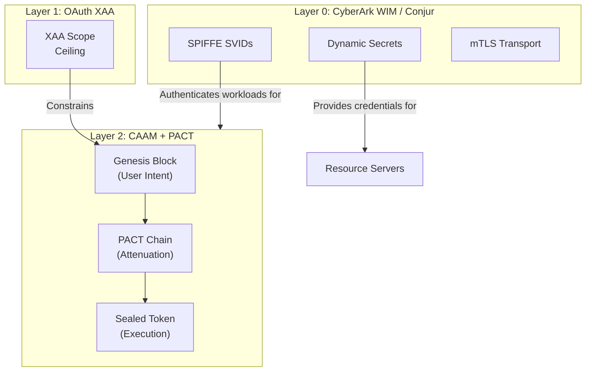
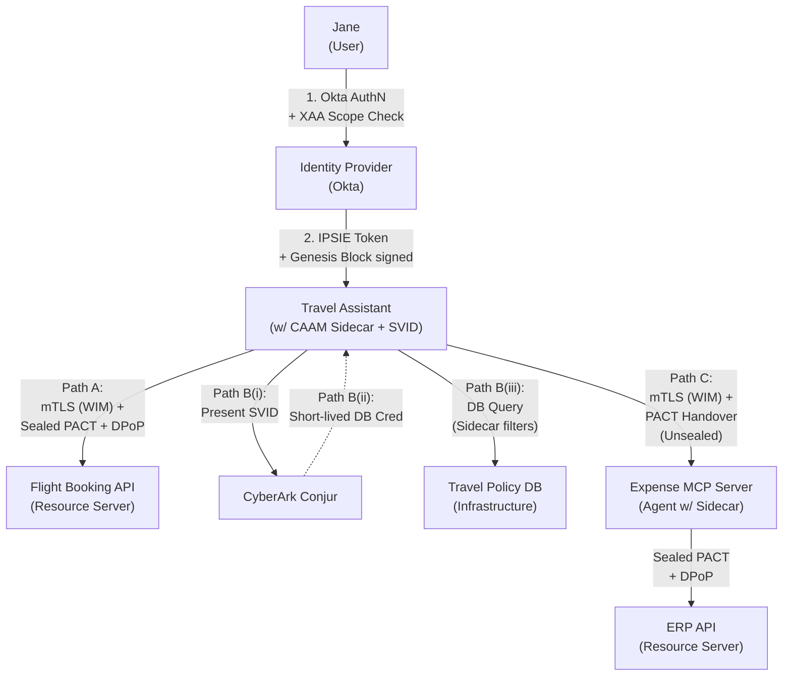
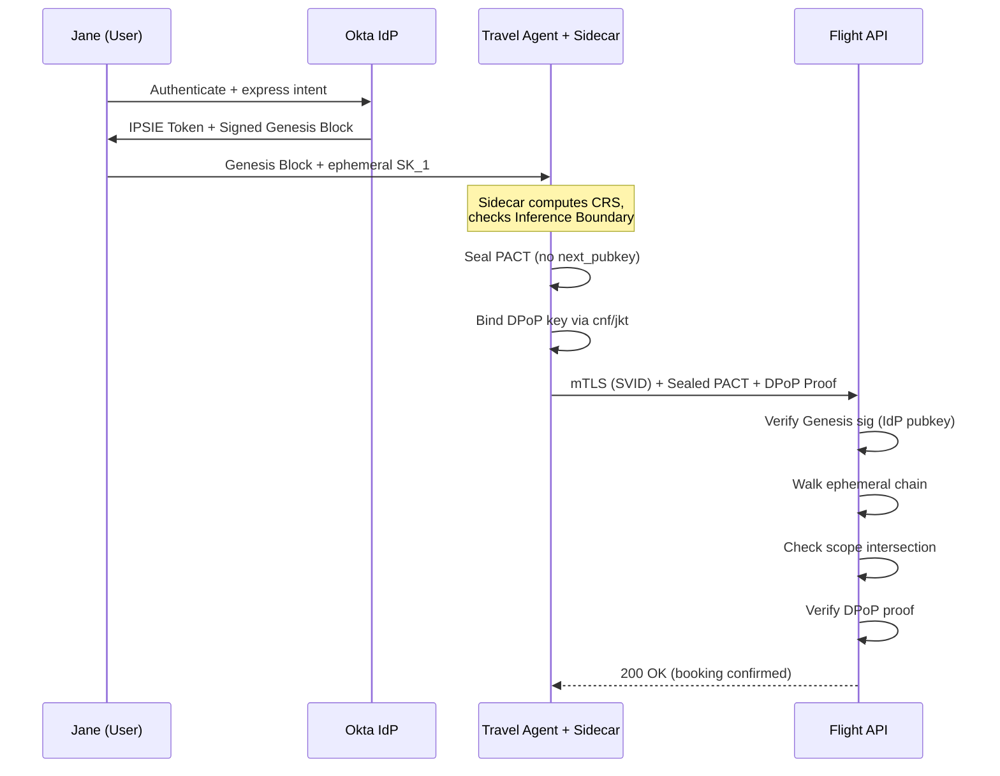
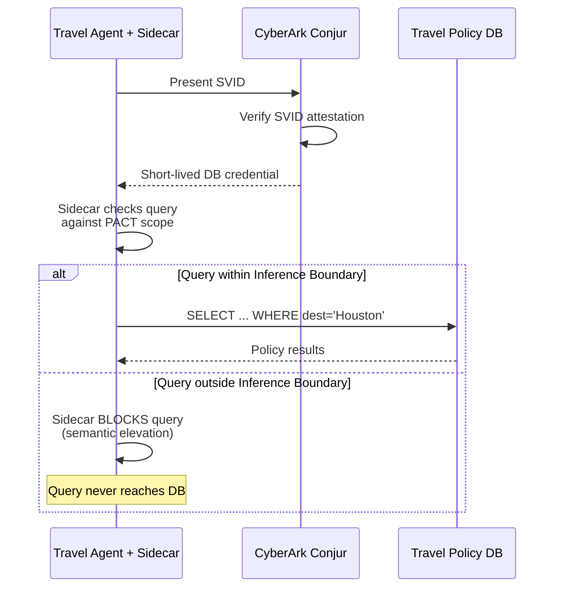
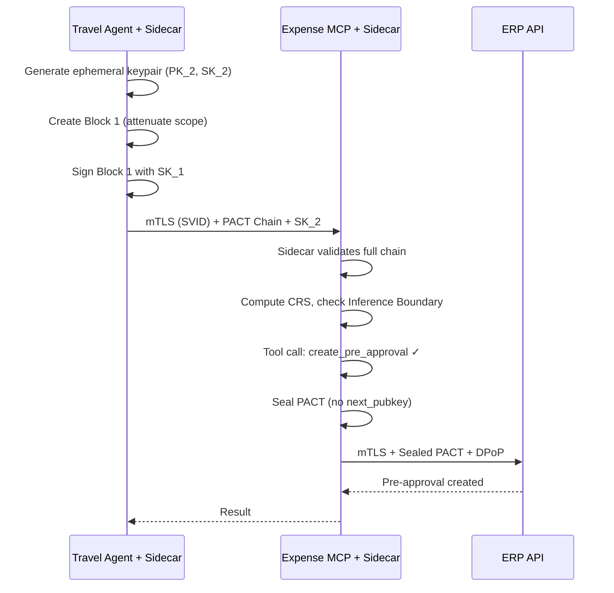
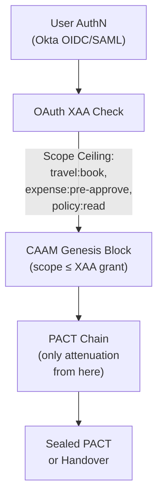
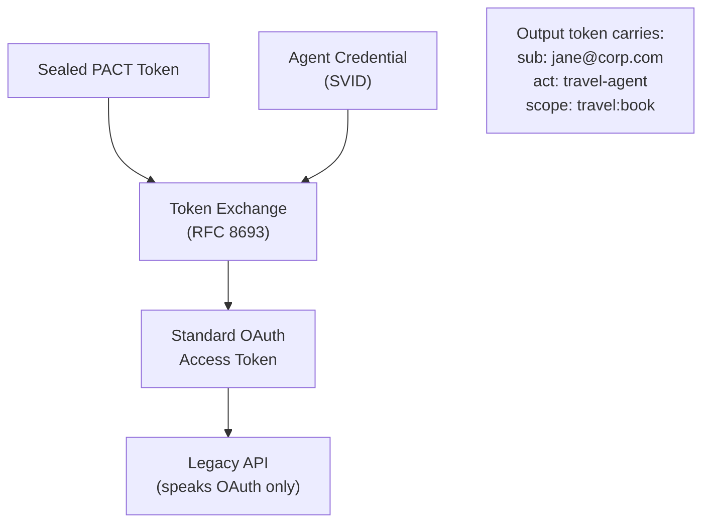
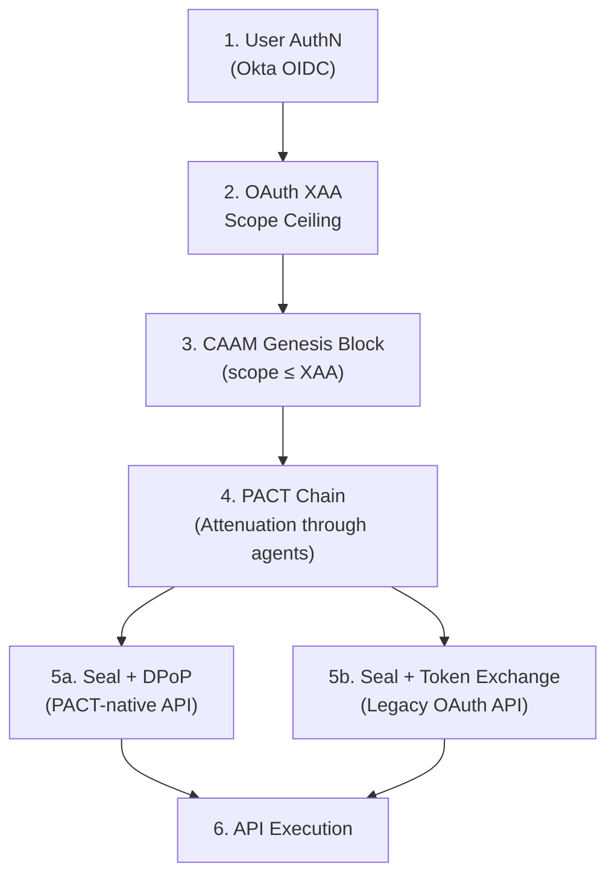

# Demystifying Agentic Trust: CAAM, PACT, and the Identity Stack

**Authors:** Jonathan M. Barney, Yogi Porla, Brad Woodward  
**Audience:** Distinguished Engineers, Partner-Level Engineering Leadership, Zero Trust Security Architects  
**Date:** March 2026  
**Reference:** `draft-barney-caam-00` (IETF Internet-Draft)

---

## Bottom Line Up Front

Autonomous agents introduce a trust problem that no single protocol solves alone. The industry has mature solutions for **workload identity** (CyberArk WIM, SPIFFE/SPIRE, Conjur) and **coarse-grained delegation** (OAuth 2.1, XAA). What is missing is a mechanism to answer the question: *"What can this agent do right now, for this specific user's intent, after passing through N other agents?"*

CAAM and its Provenance-Attenuated Chain Token (PACT) architecture answer that question. They do not replace workload identity or OAuth — they stack on top of both to create a complete trust model for agentic systems.

```
┌─────────────────────────────────────────────────────────┐
│  Layer 2: CAAM + PACT                                   │
│  Contextual Authorization & Intent Propagation           │
│  "What can this agent do for this intent right now?"     │
├─────────────────────────────────────────────────────────┤
│  Layer 1: OAuth 2.1 / XAA                                │
│  Coarse-Grained Delegation & Scope Ceiling               │
│  "May this user delegate to this agent at all?"          │
├─────────────────────────────────────────────────────────┤
│  Layer 0: CyberArk WIM / SPIFFE / Conjur                │
│  Workload Identity & Secrets Management                  │
│  "Who is this workload? What credentials does it need?"  │
├─────────────────────────────────────────────────────────┤
│  Infrastructure: Kubernetes, Cloud, Network               │
└─────────────────────────────────────────────────────────┘
```

**Key principle:** Each layer handles exactly one concern. CAAM never issues identities (Layer 0 does). OAuth XAA never tracks multi-hop intent (CAAM does). CyberArk WIM never makes authorization decisions about user intent (it provides the transport-layer "who are you?" that everything else depends on).

---

## 1. The Layer Separation: Why You Need All Three

### Layer 0 — Workload Identity (CyberArk WIM / SPIFFE / Conjur)

**Question answered:** *"Is this workload what it claims to be?"*

CyberArk Workload Identity Manager replaces static service account secrets with automatically rotated, short-lived SPIFFE SVIDs. Conjur vaults and auto-rotates database credentials, API keys, and other infrastructure secrets.

**What it provides:**
- Workload attestation at the infrastructure layer (container image, pod identity, node attestation)
- mTLS transport authentication between workloads
- Dynamic secret retrieval with audit trails
- Certificate lifecycle management (issuance, rotation, revocation)

**What it does NOT provide:**
- No concept of user intent or delegation chains
- No awareness of what the workload is doing on behalf of a specific human
- No ability to constrain actions to a specific purpose or session

### Layer 1 — Coarse-Grained Delegation (OAuth XAA)

**Question answered:** *"Is this user allowed to delegate to this agent for these resource scopes?"*

OpenID Cross-App Access (XAA) establishes the **scope ceiling** — the maximum set of resources and actions that a delegation chain can touch. It operates at the identity provider level, before CAAM is ever invoked.

**What it provides:**
- Per-user, per-engagement delegation policies (e.g., "Jane on Engagement ABC may use Travel Assistant for Concur, Sabre, Expense System")
- The scope ceiling that constrains the PACT Genesis Block

**What it does NOT provide:**
- No per-request context (budget caps, specific destinations, time-bound constraints)
- No multi-hop delegation tracking
- No attenuation or intersection of permissions across intermediary agents

### Layer 2 — Contextual Authorization (CAAM / PACT)

**Question answered:** *"For this specific user's intent, through these specific agents, what actions are authorized right now?"*

CAAM defines the Post-Discovery Authorization Handshake and the Contextual Risk Score (CRS). PACT provides the cryptographic primitive that makes multi-hop intent delegation tamper-proof without requiring heavyweight infrastructure at every hop.

**What it provides:**
- Immutable user intent propagation across N agent hops
- Scope attenuation (Intersection of Permissions) — every agent can narrow, none can widen
- Non-repudiation and proof of participation for every agent in the chain
- Preemptive security — requests fail cryptographic validation before execution, not after detection
- Cross-organizational delegation without requiring shared identity infrastructure

**What it does NOT provide:**
- No workload identity issuance (delegates to Layer 0)
- No credential management (delegates to Conjur)
- No coarse-grained delegation policy (delegates to XAA)



---

## 2. Use Case: The 3-Path Request Flow

**Scenario:** User Jane asks a "Travel Assistant" agent to book travel to Houston under $2,000. The agent must:

| Path | Target | Type | Key Question |
|------|--------|------|-------------|
| A | Flight Booking REST API | Resource Server | How does a sealed PACT token reach a standard API? |
| B | Corporate Travel Policy DB | Infrastructure (Service Account) | How does CAAM constrain a broad DB credential? |
| C | Expense Pre-Approval MCP Server | Agent-to-Agent (A2A) | How does the PACT chain extend through another agent? |

### Architecture Diagram



---

### Path A: REST API (Flight Booking) — Token Seals Here

This is a terminal action — the agent calls a Resource Server directly. The PACT chain ends.

#### Authentication (two layers, both required)

| Layer | Mechanism | Proves |
|-------|-----------|--------|
| Transport | mTLS via SPIFFE SVIDs (CyberArk WIM) | "This workload IS the Travel Assistant, running in the expected pod/node" |
| Application | Sealed PACT + DPoP (RFC 9449) | "This specific request is sender-constrained and carries Jane's attenuated intent" |

#### Authorization

The sidecar **seals** the PACT token because the target is a Resource Server, not another CAAM-compliant agent. Sealing means appending a terminal block with no `next_pubkey`, cryptographically closing the chain. The sealed token carries the `cnf`/`jkt` claim bound to the agent's DPoP key, preventing replay by any other party.

The Flight API validates:
1. **Genesis Block signature** — verified against the IdP's public key (one network call)
2. **Ephemeral key chain** — each block signed by the previous block's ephemeral key (no network calls)
3. **Scope intersection** — the booking request (`$1,800 flight to Houston`) falls within the collapsed intent (`travel:book`, destination: Houston, budget: $2,000)
4. **DPoP proof** — the HTTP request carries a proof matching the `cnf`/`jkt` thumbprint

If the agent attempts to book a $3,000 flight to NYC, the request fails cryptographic validation **before the API processes it**.

#### Sequence



#### CyberArk WIM's role
Without WIM, the mTLS connection requires a static client certificate or API key. WIM automates the SVID lifecycle — issuance, rotation, revocation — so the agent never touches a long-lived credential.

---

### Path B: Database via Service Account (Travel Policy) — Sidecar as Inference Firewall

This path never involves PACT at the database level. The database speaks SQL, not PACT. But CAAM still enforces intent constraints via the sidecar.

#### Authentication (two-step credential retrieval)

```
Step 1: Agent → Conjur
┌─────────────────────────────────────────────────────┐
│ Agent presents its SPIFFE SVID to Conjur            │
│ Conjur verifies: "Is this the Travel Assistant?"    │
│ Conjur checks: "Is this SVID still valid?"          │
│ Conjur returns: short-lived DB credential           │
│ (auto-rotated, time-bound, audited)                 │
└─────────────────────────────────────────────────────┘

Step 2: Agent → Database
┌─────────────────────────────────────────────────────┐
│ Agent connects using the Conjur-issued credential   │
│ Database authenticates the service account normally  │
└─────────────────────────────────────────────────────┘
```

#### Authorization (the Inference Firewall)

The service account may have broad `SELECT` access to the travel policy database. But the CAAM sidecar acts as a **semantic firewall**:

- The PACT token says: `purpose: "book travel to Houston"`, `scope_ceiling: ["travel:book", "policy:read"]`
- The sidecar intercepts every outbound query and validates it against the Inference Boundary
- **Allowed:** `SELECT * FROM policies WHERE destination = 'Houston' AND category = 'travel'`
- **Blocked:** `SELECT * FROM policies WHERE category = 'compensation'` (semantic elevation of privilege — technically within the DB credential's access, but outside the user's intent)

This is the critical gap that CyberArk alone cannot fill. Conjur secures the credential lifecycle. CAAM constrains what the credential is used **for**.

#### Sequence



#### CyberArk Conjur's role
Critical. This is the classic Conjur use case — no static password in a config file, credential is short-lived and auto-rotated, and Conjur's audit trail shows who retrieved what credential and when. CAAM adds the "what was it used for?" audit dimension.

---

### Path C: MCP Server (Expense Pre-Approval) — PACT Chain Extends

This is Agent-to-Agent (A2A) communication. The PACT chain does **not** seal — it extends with a new block.

#### Authentication

| Layer | Mechanism | Proves |
|-------|-----------|--------|
| Transport | mTLS between sidecars (both have WIM-issued SVIDs) | Both workloads are what they claim to be |
| Application | PACT Ephemeral Handover | The Travel Agent's participation is cryptographically recorded and immutable |

#### Authorization (Intersection of Permissions)

The Travel Agent **attenuates** the PACT token before handing it to the MCP server:

```
Genesis Block (Block 0):
  purpose:       "book travel to Houston"
  scope_ceiling: ["travel:book", "expense:pre-approve", "policy:read"]
  budget:        $2,000
  max_hops:      3
  next_pubkey:   PK_1

Travel Agent's Block (Block 1):
  attenuated_scope: ["expense:pre-approve"]
  budget:           $2,000 (unchanged — pass-through)
  max_hops:         2 (decremented)
  next_pubkey:      PK_2
  signed_by:        SK_1
```

The MCP server's sidecar validates the full chain: Genesis (Jane's IdP) → Block 1 (Travel Agent). It then determines what tools are within scope:

| MCP Tool | Scope Required | PACT Allows? | Result |
|----------|---------------|--------------|--------|
| `create_pre_approval` | `expense:pre-approve` | Yes | **Permitted** |
| `check_policy` | `expense:pre-approve` | Yes | **Permitted** |
| `submit_receipt` | `expense:submit` | No | **Blocked** |

When the MCP server calls the downstream ERP API to create the pre-approval, it **seals** the PACT token (because the ERP is a Resource Server, not another agent).

#### Sequence



#### CyberArk WIM's role
Both the mTLS connection between sidecars and the MCP server's own connection to the ERP API require SVID-based transport authentication. If the MCP server also needs database credentials for the ERP, those come from Conjur.

---

## 3. Protocol Intersections: Where XAA and Token Exchange Fit

### OAuth XAA: The Gate at the Top

XAA operates **before the PACT chain is minted**. It answers: *"May this user delegate to this agent for these resource scopes?"*



**XAA is the ceiling.** The Genesis Block's `scope_ceiling` is derived directly from the XAA grant. If XAA says Jane can access Concur and Sabre through the Travel Agent, the Genesis Block cannot include S3 bucket access. Every downstream PACT block can only go narrower.

### Token Exchange (RFC 8693): The Bridge at the Bottom

Token Exchange lives at the **opposite end** of the flow — it converts a sealed PACT token into a standard OAuth bearer token for APIs that don't understand PACT natively.



**What Token Exchange replaces and what it doesn't:**

| Use Case | Traditional OBO | With PACT |
|----------|----------------|-----------|
| Single-hop delegation to a Resource Server | Token Exchange (RFC 8693) | **Still used** — as a backward-compatibility shim for APIs that don't speak PACT |
| Multi-hop delegation chain | Nested wrapping/re-signing at every hop | **Replaced by PACT** — ephemeral key chain eliminates wrapping entirely |
| "Act as" claim preservation | `act` claim in exchanged token | **Still used** — the exchanged token carries the `act` claim from the PACT chain |

As APIs natively adopt PACT, the Token Exchange step disappears. But for the next several years, it is the glue that makes CAAM work with the existing OAuth ecosystem.

### Complete Authorization Flow



| Step | Layer | Protocol | Grain |
|------|-------|----------|-------|
| 1. User AuthN | Identity | OIDC / SAML | User identity |
| 2. XAA Check | Delegation | OpenID XAA | Coarse — which agents, which resource scopes |
| 3. Genesis Block | Intent | CAAM SCO / PACT Block 0 | Fine — purpose, budget, max hops |
| 4. PACT Chain | Attenuation | PACT ephemeral key handover | Per-hop — intersection of permissions |
| 5a/5b. Seal or Exchange | Execution | DPoP / RFC 8693 | Per-request — single-use, sender-constrained |
| 6. API Call | Enforcement | Bearer token or PACT | Resource Server validates and executes |

---

## 4. Summary Matrix: AuthN vs AuthZ at Every Boundary

| Boundary | AuthN — "Who are you?" | AuthZ — "What can you do?" |
|----------|----------------------|---------------------------|
| **User → Agent** | IdP (Okta / IPSIE token) | XAA (coarse ceiling) + CAAM Genesis Block (fine intent) |
| **Agent → REST API** | CyberArk WIM (mTLS via SVID) + DPoP | Sealed PACT (intent constraints, scope intersection) |
| **Agent → Conjur** | CyberArk WIM (SVID proves workload identity) | Conjur policy (which secrets this workload can access) |
| **Agent → Database** | Conjur-issued short-lived credential | CAAM Sidecar Inference Firewall (semantic scope enforcement) |
| **Agent → MCP Server** | CyberArk WIM (mTLS between sidecars) | PACT Handover (attenuation, intersection of permissions) |
| **MCP Server → ERP API** | CyberArk WIM (mTLS) + DPoP | Sealed PACT (collapsed multi-hop intent) |

**The pattern:** CyberArk WIM handles every transport-layer AuthN question. CAAM/PACT handles every application-layer AuthZ question. They never overlap — they stack.

---

## 5. What PACT Solves That Nothing Else Does

### 5.1 The Confused Deputy Problem
A malicious Agent A passes a crafted intent to a higher-privileged Agent B, tricking B into performing an unauthorized action. PACT prevents this because Agent B's sidecar validates that the requested action falls within the PACT scope — a crafted intent from Agent A that requests an out-of-scope action fails validation even if Agent B has the technical capability to perform it.

### 5.2 The Unwrapping Vulnerability
Traditional nested token approaches (OBO, LSVID ID-Mode) wrap claims in signed envelopes. A malicious intermediary can strip the outer envelope and pretend the attenuation never happened. PACT makes this impossible — removing a block breaks the ephemeral key chain because the next block's signature was created with the previous block's private key, which no longer exists.

### 5.3 Cross-Organizational Federation
SPIFFE requires known audience claims and complex federation configuration. PACT intermediaries can be **fully anonymous** — only the Genesis Block's issuer (the IdP) and any "Proper Channels" checkpoints need verifiable identities. The receiving organization validates the IdP signature and the chain integrity without needing to know the internal topology of the sending organization.

### 5.4 Lateral Movement Prevention
If an attacker compromises an intermediary agent, they possess only the ephemeral private key for that specific transaction. They cannot:
- Generate a new Genesis Block (they don't have the IdP's keys)
- Alter previous blocks (they don't have previous ephemeral keys)
- Pivot to a different API (the token is cryptographically bound to the original intent)

The blast radius is strictly limited to the attenuated scope at the compromised agent's position in the chain.

### 5.5 Preemptive Security
Traditional security is reactive — an observability tool detects anomalous API calls and triggers a response. PACT is preemptive — every transaction is intent-based and cryptographically sealed. If the request doesn't match the cryptographic intent, it is dropped before execution. There is nothing to detect because the attack never happens.

---

## Appendix A: Key Terminology

| Term | Definition |
|------|-----------|
| **CAAM** | Contextual Agent Authorization Mesh — the authorization profile governing agent behavior after discovery |
| **PACT** | Provenance-Attenuated Chain Token — the append-only, ephemeral-key-chained token format |
| **Genesis Block** | Block 0 of the PACT chain, signed by the IdP, containing the user's identity and original intent |
| **Ephemeral Handover** | The process of passing an ephemeral private key to the next agent so it can sign the next block |
| **Sealed PACT** | The final state of an PACT chain after the executing agent appends a terminal block with no `next_pubkey` |
| **SCO** | Session Context Object — the `ctx` claim in the Genesis Block carrying purpose, scope ceiling, max hops, and CRS |
| **CRS** | Contextual Risk Score — a composite score (0–1) computed from Provenance, EnvTrust, and DataSensitivity |
| **Intersection of Permissions** | The principle that the effective authorization is the mathematical intersection of all constraints applied across the chain |
| **Inference Boundary** | The sidecar-enforced constraint on which data sources an agent may access within a session |
| **XAA** | OpenID Cross-App Access — the coarse-grained delegation mechanism that sets the scope ceiling |
| **DPoP** | Demonstration of Proof-of-Possession (RFC 9449) — sender-constraining mechanism binding a token to a specific key |
| **WIM** | CyberArk Workload Identity Manager — automates SPIFFE SVID lifecycle for workloads |
| **Conjur** | CyberArk secrets manager providing dynamic, short-lived credentials with audit trails |
| **RATS** | Remote ATtestation procedureS (RFC 9334) — optional defense-in-depth layer for environmental assurance |

## Appendix B: PACT Token Structure

```
┌──────────┬────────────┬────────────┬─────┬────────────┬───────────────┐
│  Header  │  Block 0   │  Block 1   │ ... │  Block N   │  Signature    │
│          │ (Genesis)  │ (Agent 1)  │     │ (Terminal) │  (Final)      │
├──────────┼────────────┼────────────┼─────┼────────────┼───────────────┤
│ alg, typ │ sub, iss,  │ delta:     │     │ delta:     │ ECDSA sig     │
│          │ purpose,   │ attenuated │     │ attenuated │ over entire   │
│          │ scope,     │ scope,     │     │ scope      │ chain by      │
│          │ max_hops,  │ next PK_2, │     │ NO next PK │ final agent   │
│          │ next PK_1  │ signed by  │     │ (sealed)   │               │
│          │ IDP sig    │ SK_1       │     │            │               │
└──────────┴────────────┴────────────┴─────┴────────────┴───────────────┘
                                                           ▲
                                                           │
                                                 Bearer token once
                                                 sealed — single use,
                                                 DPoP sender-constrained
```
