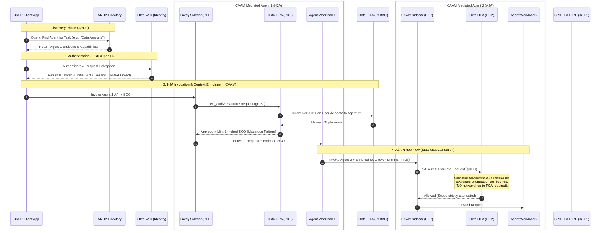

# ADR 0002: CAAM POC Component Architecture and Protocol Flows

## Status
Proposed

## Context
Following the selection of the Okta Suite, Envoy, and SPIFFE for the Contextual Agent Authorization Mesh (CAAM) Proof of Concept (ADR 0001), engineering requires a concrete blueprint mapping the system architecture, network flows, and protocol handoffs. 

Crucially, this architecture must account for the **Agent Resolution and Discovery Protocol (ARDP)**, which occurs prior to the CAAM authorization handshake. To accelerate MVP delivery and maintain strategic alignment, this ADR defines the sequence of operations from discovery to N-hop Agent-to-Agent (A2A) execution, explicitly delineating between "Out-of-the-Box" (OOTB) capabilities and "To-Be-Built" engineering tasks.

## Decision Drivers
*   **Clear Build vs. Buy Delineation:** Engineers must know exactly which components to deploy via configuration (OOTB) versus what requires custom code (To-Be-Built).
*   **Protocol Interoperability:** Visualizing the handoffs between ARDP (Discovery), IPSIE (Identity), SPIFFE (Workload Identity), and CAAM (Authorization).
*   **Actionable MVP Roadmap:** The architecture must be structured so product and engineering teams can sequence sprints logically, focusing on the highest-risk integrations first.

## Architecture Diagram (Flows & Protocols)

The following sequence diagram illustrates the end-to-end flow, emphasizing the H2A (Human-to-Agent) and subsequent A2A (Agent-to-Agent) N-hop delegations.

## Technology Stack Matrix

To support the flows above, the components are classified by their implementation effort to guide MVP sprint planning.

| Component / Capability | Technology | Status | Engineering Effort (MVP) |
| :--- | :--- | :--- | :--- |
| **User Authentication** | Okta Workforce Identity | **OOTB** | **Low:** Configure OIDC/IPSIE profiles. |
| **Shadow Agent Discovery** | Okta ISPM | **OOTB** | **Low:** Deploy and connect to cloud environments. |
| **Policy Engine (PDP)** | Okta OPA | **OOTB** | **Medium:** Deploy binary, but requires writing custom Rego policies to evaluate the SCO. |
| **Policy Store (ReBAC)** | Okta FGA | **OOTB** | **Medium:** OOTB SaaS, but requires designing the initial CAAM Relationship Schema (Graph). |
| **Workload Identity** | SPIFFE / SPIRE | **OOTB** | **Medium:** Infrastructure deployment to issue mTLS certificates to Envoy sidecars. |
| **Sidecar Proxy (PEP)** | Envoy | **OOTB** | **High:** Requires complex `ext_authz` configuration to route traffic to OPA and handle token manipulation. |
| **Agent Discovery** | ARDP Resolver | **To-Be-Built** | **High:** Build a lightweight mock directory/registry that implements the ARDP draft spec. |
| **Context Enrichment** | Macaroon Minting Logic | **To-Be-Built** | **High:** Custom logic (likely an Envoy WASM filter or a specialized OPA sidecar service) to transform the initial SCO into an attenuated N-hop token. |
| **Test Workloads** | Agent 1 & Agent 2 | **To-Be-Built** | **Medium:** Simple mock APIs (e.g., Python/FastAPI) simulating agent behavior to prove the mesh works. |

## Decision Outcome

We will adopt this component architecture as the blueprint for the CAAM POC. By isolating custom engineering to the **Sidecar/Proxy layer (Envoy + Custom Macaroon Logic)** and the **ARDP Resolver**, we maximize the leverage of enterprise-grade Okta and SPIFFE components for the heavy lifting of identity and graph management.

### Engineering Execution & MVP Prioritization

This architecture allows for a phased, MECE (Mutually Exclusive, Collectively Exhaustive) engineering approach. The MVP should be prioritized as follows:

*   **Phase 1: Foundation (The Plumbling)**
    *   Deploy SPIRE to establish mTLS between two mock agent containers.
    *   Configure Okta FGA with a basic CAAM schema (`User -> delegates_to -> Agent -> accesses -> Resource`).
*   **Phase 2: The Core H2A Intercept (The Control Point)**
    *   Deploy Envoy in front of Mock Agent 1.
    *   Connect Envoy to Okta OPA via `ext_authz`.
    *   Write the Rego policy in OPA that extracts the SCO, calls the Okta FGA API, and makes an Allow/Deny decision.
*   **Phase 3: Context Enrichment & N-Hop (The Differentiator)**
    *   Implement the Macaroon minting logic at Agent 1's sidecar.
    *   Prove that Agent 2's sidecar can validate the enriched SCO statelessly without querying FGA, strictly enforcing the attenuated `ctx` bounds.
*   **Phase 4: Discovery (The Front Door)**
    *   Build the ARDP mock resolver to automate the bootstrapping of Phase 2.

## Consequences (Self-Correction & Evaluation)

*   **Positive:** The diagram perfectly matches the structural constraints of ADR 0001, explicitly illustrating how the "Macaroon Pattern" mitigates FGA latency in A2A flows.
*   **Positive:** The "Technology Stack Matrix" clearly separates boilerplate deployment from core engineering IP, adhering to McKinsey's standard for actionable, high-level strategic alignment.
*   **Risk:** The highest engineering risk is the "Context Enrichment / Macaroon Minting Logic" within the Envoy pipeline. If a WASM filter proves too complex for the MVP timeframe, engineering may need to self-correct by building a dedicated "CAAM Auth Service" microservice that Envoy calls out to, rather than doing token transformation natively in the proxy.